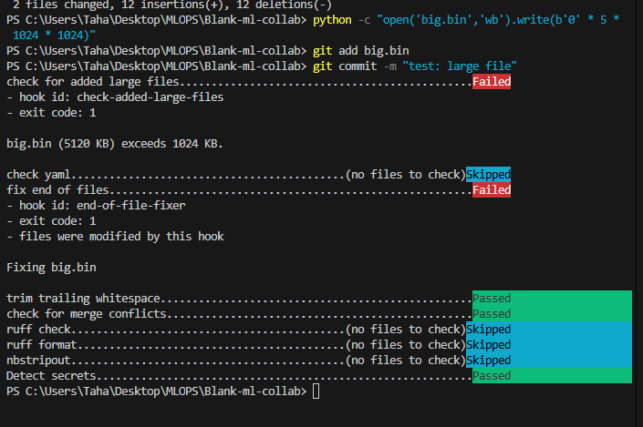
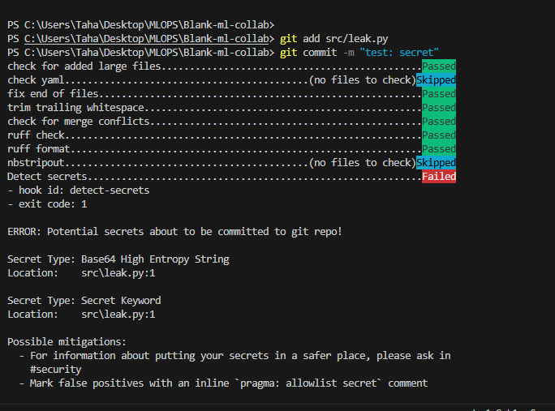
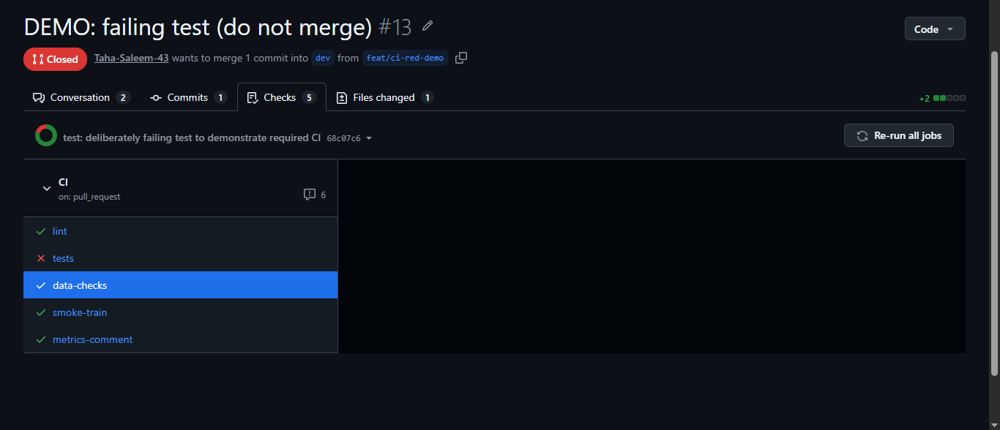
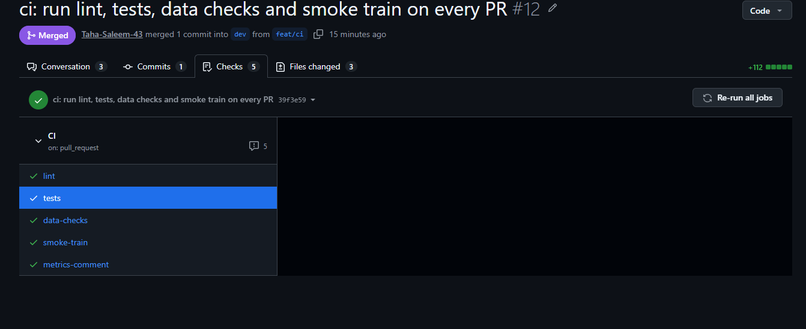
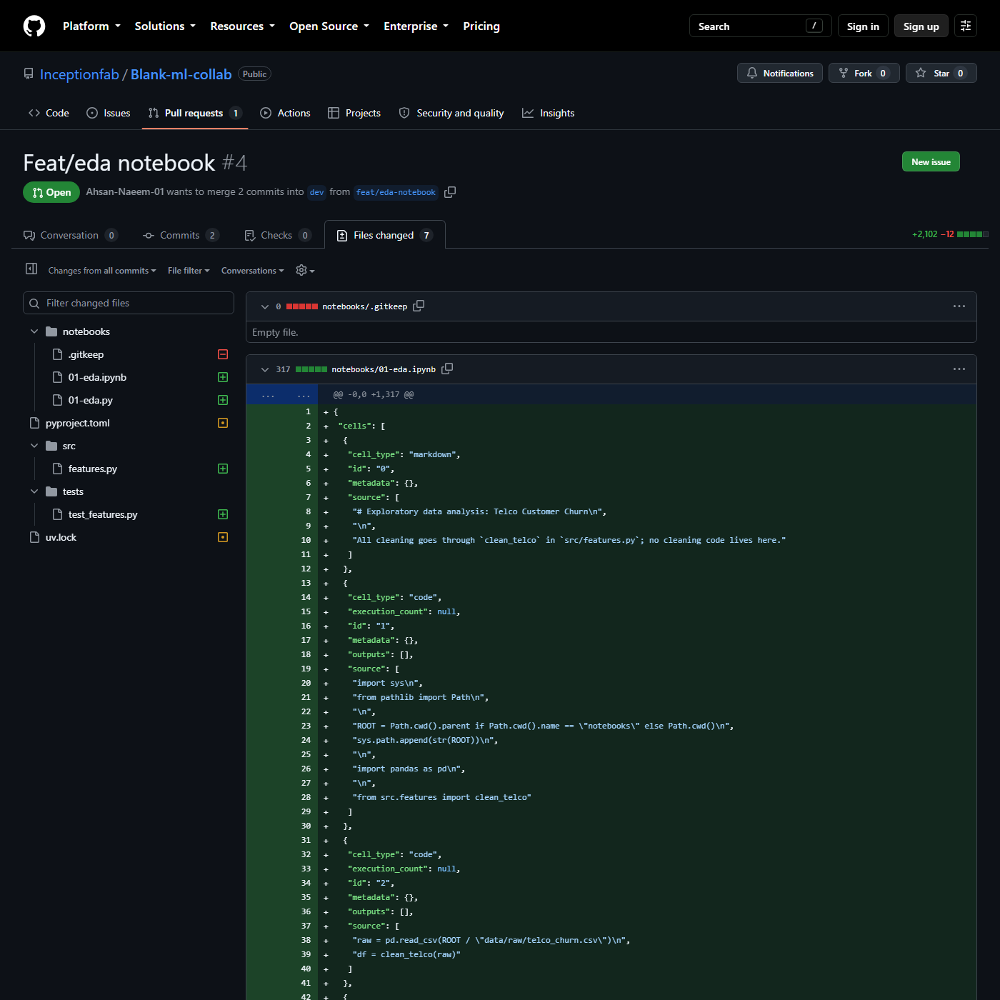

# REPORT: Blank-ml-collab (Telco Customer Churn)

## 1. Team, roles, dataset and starter code
| Member | GitHub | Role |
|---|---|---|
| Ahsan | @Ahsan-Naeem-01 | Data owner: DVC, data checks, dataset updates |
| Fahad | @FahadRahmanx | Model owner: training pipeline, configs, experiments |
| Taha | @Taha-Saleem-43 | Platform owner: CI, pre-commit, environment, releases |

- **Dataset:** Telco Customer Churn, https://www.kaggle.com/datasets/blastchar/telco-customer-churn
  (original file `WA_Fn-UseC_-Telco-Customer-Churn.csv`, stored as `data/raw/telco_churn.csv`, tracked by DVC on DagsHub:
  https://dagshub.com/Taha-Saleem-43/Blank-ml-collab).
- **Starter code:** "CUSTOMER CHURN PREDICTION 📈" by Bharti Prasad, https://www.kaggle.com/code/bhartiprasad17/customer-churn-prediction.
  What we changed: removed Kaggle paths and plots, moved all preprocessing into an sklearn Pipeline fit on the training split only
  (the original label-encoded every categorical column and filled missing `TotalCharges` values with the full dataset's mean
  before splitting, which leaked test-set categories and statistics into training), split the code into prepare/train/evaluate DVC stages,
  and moved every hyperparameter, the split ratio and the seed into params.yaml.

## 2. Reproducibility of model-v1.0
| Item | Value |
|---|---|
| Release tag | `model-v1.0` → commit `…` |
| Commit that trained the model (`git_commit` in metrics.json) | `c9e69d2ca7061aa0e523fa1b536d89de8ad40243` (PR #8) |
| params.yaml | seed 42 · test_size 0.2 · model logistic_regression · C 3.0 (RF-only params unused) |
| Data version | `data/raw/telco_churn.csv.dvc` md5 `26b9f047a955a4b9660c9673ff385145` · 7,032 rows × 21 columns |
| Environment | `uv.lock` at the tag · Python 3.12 (`.python-version`) |
| Pipeline lock | `dvc.lock` at the tag |
| Seed | 42: split, shuffling, model initialisation, CI sample |
| Final metrics | roc_auc 0.8356 · f1 0.611 · precision 0.6486 · recall 0.5775 · accuracy 0.8045 |
| Independent reproduction | Ahsan, fresh clone, PR #15: identical metrics ✅ (link: …) |

How to reproduce:
```bash
git clone --branch model-v1.0 https://github.com/Inceptionfab/Blank-ml-collab.git
cd Blank-ml-collab && uv sync --frozen && uv run dvc pull && uv run dvc repro --force
```

## 3. Experiments

Baseline (dev before any tuning, random forest defaults): roc_auc 0.8341 · f1 0.5386 · precision 0.6552 · recall 0.4572 · accuracy 0.7918

| Experiment | model | n_estimators | max_depth | min_samples_leaf | C | roc_auc | f1 | precision | recall | accuracy |
|---|---|---|---|---|---|---|---|---|---|---|
| fahad-depth4 | random_forest | 100 | 4 | 1 | 1 | 0.8301 | 0.4845 | 0.6779 | 0.3770 | 0.7868 |
| fahad-depth8 | random_forest | 100 | 8 | 1 | 1 | 0.8343 | 0.5667 | 0.6538 | 0.5000 | 0.7967 |
| fahad-depth10 | random_forest | 100 | 10 | 1 | 1 | 0.8301 | 0.5668 | 0.6367 | 0.5107 | 0.7925 |
| fahad-depth12 | random_forest | 100 | 12 | 1 | 1 | 0.8253 | 0.5652 | 0.6246 | 0.5160 | 0.7889 |
| ahsan-lr-c10 | logistic_regression | – | – | – | 10 | 0.8353 | 0.6054 | 0.6426 | 0.5722 | 0.8017 |
| ahsan-lr-c1 | logistic_regression | – | – | – | 1 | 0.8359 | 0.6099 | 0.6495 | 0.5749 | 0.8045 |
| ahsan-lr-c0.1 | logistic_regression | – | – | – | 0.1 | 0.8352 | 0.6074 | 0.6543 | 0.5668 | 0.8053 |
| taha-d9-leaf5-300 | random_forest | 300 | 9 | 5 | 1 | 0.8359 | 0.5774 | 0.6510 | 0.5187 | 0.7982 |
| taha-d11-leaf10 | random_forest | 100 | 11 | 10 | 1 | 0.8363 | 0.5535 | 0.6464 | 0.4840 | 0.7925 |
| taha-d9-leaf5 | random_forest | 100 | 9 | 5 | 1 | 0.8357 | 0.5654 | 0.6460 | 0.5027 | 0.7946 |
| taha-d7-leaf5 | random_forest | 100 | 7 | 5 | 1 | 0.8355 | 0.5491 | 0.6439 | 0.4786 | 0.7910 |

**Winner of the team comparison:** `ahsan-lr-c1` (logistic regression, C=1.0). Our rule is the highest ROC-AUC, and if runs are within 0.001,
the higher F1 wins. taha-d11-leaf10 had the top ROC-AUC (0.8363), but ahsan-lr-c1 was within 0.001 (0.8359) and had the best F1 of all
11 runs (0.6099 vs 0.5535), against a random-forest baseline of 0.8341 / 0.5386. It was promoted in #7.

**Final model after the conflict (#8):** Taha's branch (random forest, n_estimators=300, max_depth=9, min_samples_leaf=5) conflicted with
#7 in params.yaml. He evaluated four candidates with the same rule and kept logistic regression with **C=3.0**:

| Candidate | model | n_estimators | max_depth | min_samples_leaf | C | roc_auc | f1 |
|---|---|---|---|---|---|---|---|
| A: dev after #7 | logistic_regression | 100 | 6 | 1 | 1.0 | 0.8359 | 0.6099 |
| B: #8's random forest | random_forest | 300 | 9 | 5 | 1.0 | 0.8359 | 0.5774 |
| C | logistic_regression | 100 | 6 | 1 | 0.3 | 0.8358 | 0.6068 |
| **D (kept)** | logistic_regression | 100 | 6 | 1 | 3.0 | 0.8356 | **0.6110** |

## 4. Links
- Data-update PR: https://github.com/Inceptionfab/Blank-ml-collab/pull/6
- Conflict-resolution PR: https://github.com/Inceptionfab/Blank-ml-collab/pull/8
- Promotion of the winning experiment: https://github.com/Inceptionfab/Blank-ml-collab/pull/7
- "Changes requested" reviews:
  - Taha on #4 (EDA notebook: key findings cited medians the notebook didn't compute): https://github.com/Inceptionfab/Blank-ml-collab/pull/4#pullrequestreview-5331267006
  - Ahsan on #5 (pipeline: CRLF `metrics.json` hash mismatch, missing `dvc.yaml` deps): https://github.com/Inceptionfab/Blank-ml-collab/pull/5#pullrequestreview-5331440967
  - Fahad on #6 (data update: dropped rows' `Churn` values, docstring, derived counts): https://github.com/Inceptionfab/Blank-ml-collab/pull/6#pullrequestreview-5331597618
- Wrong-base incident: #9 was merged into `main` by mistake (https://github.com/Inceptionfab/Blank-ml-collab/pull/9), reverted through
  a reviewed PR (https://github.com/Inceptionfab/Blank-ml-collab/pull/10) and re-merged into `dev` (https://github.com/Inceptionfab/Blank-ml-collab/pull/11)
- Release PRs: <link to #15 (dev → staging)>, <link to #16 (staging → main)>
- Abandoned experiment branch: https://github.com/Inceptionfab/Blank-ml-collab/tree/exp/fahad-max-depth. Abandoned because the best
  max_depth run (fahad-depth8: roc_auc 0.8343, f1 0.5667) lost to logistic regression (ahsan-lr-c1: 0.8359, 0.6099); we kept one model
  family. exp/ahsan-logreg and exp/taha-regularisation also stay unmerged, as our exp/ rule requires.
- Bonus: hotfix PR <#17>, tag `model-v1.0.1`, back-merge <#18>; CML metrics comments on every PR

## 5. Screenshots






## 6. Retrospective
- **What broke:** …
- **What we standardised:** …
- **Added to CONTRIBUTING.md because of it:** …

## 7. Individual contributions
### Ahsan
I was the data owner. I put the raw Telco CSV under DVC with a DagsHub remote (#3), so only its `.dvc` pointer is in Git
history, and I built the EDA notebook around a reusable, unit-tested `clean_telco` function in `src/features.py`, paired with
jupytext and stripped by nbstripout (#4); Taha's requested change there made me compute the medians quoted in the key findings.
In #6 I removed the 11 zero-tenure customers whose `TotalCharges` was blank (all of them `Churn = No`), pushed the new data
version to DagsHub before the Git push, and showed `git switch` + `dvc checkout` moving between 7,043 and 7,032 rows. My
logistic-regression C sweep on `exp/ahsan-logreg` won the team comparison, and I promoted `ahsan-lr-c1` in #7. I added schema,
range and null checks plus the seeded, Churn-stratified 300-row sample that CI uses; I first opened that PR against `main` by
mistake (#9), reverted it through a reviewed PR (#10) and re-merged it into `dev` (#11). As a reviewer I approved the pre-commit
setup (#2) and CI (#12), and on #5 I requested changes after a fresh-clone `dvc repro` exposed a CRLF hash mismatch in
`metrics.json`, missing `dvc.yaml` dependencies and metrics logged with `code_uncommitted: true`.

### Fahad
I picked up the Kaggle starter notebook and made it runnable from the command line (`src/train.py` on `main`), stripping the
plots and notebook-only calls down to a single trainable script. I opened #1 to formalize the branch/merge model for the team —
squash-merge for `feat/`/`data/` branches into `dev`, merge commits for releases and `fix/` branches into `main` — since mixing
strategies was going to give `dev` and `main` diverging histories at release time. On #5 I split the starter into the
prepare/train/evaluate DVC pipeline and moved every preprocessing step (imputer, scaler, one-hot encoder) inside a single
sklearn Pipeline fit on the training split only, fixing the leakage in the original code. Ahsan's review on #5 caught three
real issues I fixed before merge: `metrics.json` was written with CRLF line endings on Windows so `dvc.lock`'s hash never
matched a fresh checkout (fixed with `newline="\n"` in `evaluate.py`), `dvc.yaml` was missing `src/utils.py` and
`src/features.py` as dependencies on the `train`/`evaluate` stages, and `metrics.json` had been committed with a stale
`code_uncommitted: true` because I'd generated it before committing the fix — I reran `dvc repro --force -s evaluate` after
committing so the logged commit hash and flag were accurate. I ran the `max_depth` sweep (`exp/fahad-max-depth`: depth 4/8/10/12)
and took part in the team-wide experiment comparison that picked `ahsan-lr-c1` over my best run (fahad-depth8, roc_auc 0.8343)
since logistic regression beat every random-forest depth we tried on both ROC-AUC and F1. I also worked #14 and #16, and helped
with the bonus hotfix #17 and its back-merge #18. On the review side I reviewed #3, requested changes on #6 (the data-update PR,
missing dropped-row `Churn` breakdown and a docstring), and reviewed #8, the revert/re-merge sequence #9/#10/#11, #15, #19 and #20.

### Taha
I served as the platform owner for the team. I established the repository, configured the uv virtual environment, set up `.gitignore`, `.gitattributes`, and enforced GitHub branch rulesets for `main`, `staging`, and `dev`. In #2, I introduced the pre-commit configuration with linters, formatters, and security checks, capturing verification screenshots for large file and secret leakage blocks. On `exp/taha-regularisation`, I executed four hyperparameter experiments tuning depth, leaf size, and trees; when my branch collided with Ahsan's promoted logistic regression in #8, I resolved the merge conflict using data-driven evaluations across four candidates, proving that logistic regression with C=3.0 was superior and pushing the winning model. I authored the comprehensive GitHub Actions CI pipeline in #12 with lint, tests, data validation, and an automated CML metrics comment, followed by enforcing required status checks and proving enforcement with the deliberately failing demo PR #13. For deployment, I managed the `model-v1.0` release from `dev` to `staging` in #15 and handled Git tag verification. Across the project lifecycle, I actively conducted code reviews, approving #1 and #7, requesting necessary changes on #4 for missing statistical medians, and reviewing the team report (#14) as well as the production and documentation releases (#16, #21).

## 8. Notes and limitations
- The only data file in Git is `tests/data/telco_sample.csv`, a 300-row fixture so CI can run data
  checks and a smoke train without DVC credentials. The full dataset exists only on the DVC remote.
- Because feature PRs are squash-merged, the `git_commit` recorded in metrics.json points to a commit
  on the PR branch; it stays visible in that PR's Commits tab and contains the same code as the release.
- PR #9 was opened against `main` by mistake and merged there; it was reverted through a reviewed PR (#10)
  and re-merged into `dev` as #11. PR #13 was a deliberately failing test that proved required CI checks
  block merging; it was closed unmerged.
- The winner was selected on the held-out test split; a separate validation split or cross-validation
  would be stricter. Several runs were within 0.001 ROC-AUC of each other, so F1 decided the winner.
